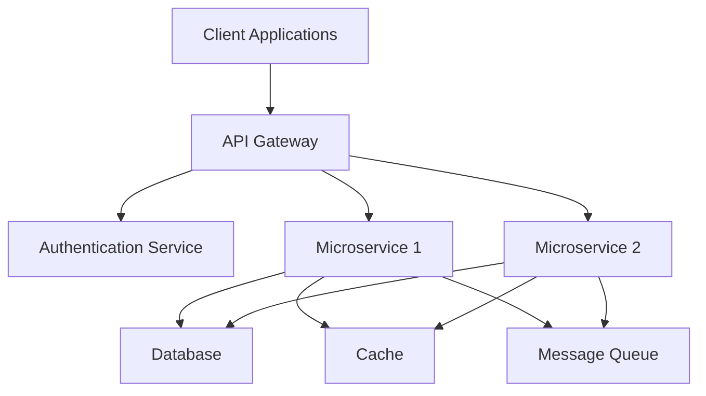

# Architecture Overview

Below is a high-level architecture overview using a Mermaid diagram.

## Description

- **Client Applications**: Frontend apps, mobile clients, or third-party services.
- **API Gateway**: Entry point for all requests, routing to services and handling security.
- **Authentication Service**: Manages user authentication and authorization.
- **Microservices**: Encapsulated business logic, scalable independently.
- **Database**: Persistent storage for application data.
- **Cache**: Improves performance by reducing database load.
- **Message Queue**: Enables asynchronous communication between microservices.